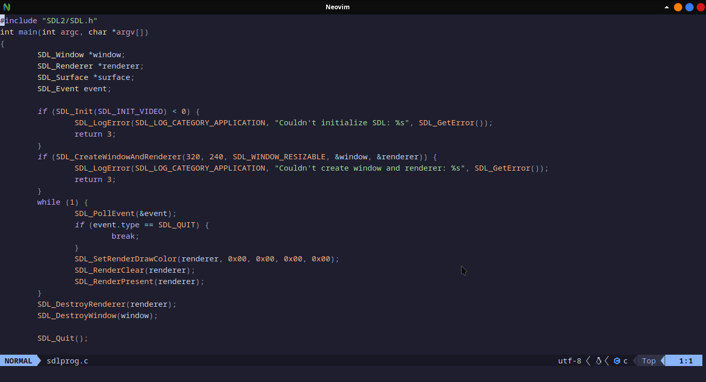

# neovim-files
These are my neovim dotfiles.

## Requirements
lua, neovim (as recent as possible), git, and a nerd font of your choice.
* Node is semi-required (due to npm, see below).

* Lua is needed for the actual configuration files as well as the plugin manager.
* The plugin manager relies on git, alongside lua.
* A nerd font is needed if you want icons to show up properly.
* Npm is used for installing language servers if you're not using mason. It's not required if you are not planning on using mason, or if you've already installed the language servers you will be using.
* Mason is a neovim plugin that manages language servers.
* The command for accessing the package manager is Lazy (preceded by a colon as all other (neo)vim commands are).
* The default global leader is backslash. backslash f opens/closes Neovim-Tree.
* The default local leader is space. This is mostly used for LSP-related things, such as fixing errors upon detection on the LSP side, or sorting imports, among other things.
* The default compiler plugin is compiler.nvim by Zeioth. 

## Screenshot

## Installation
```bash
git clone github.com/Jonte-P/neovim-files ~/.config/nvim
```


